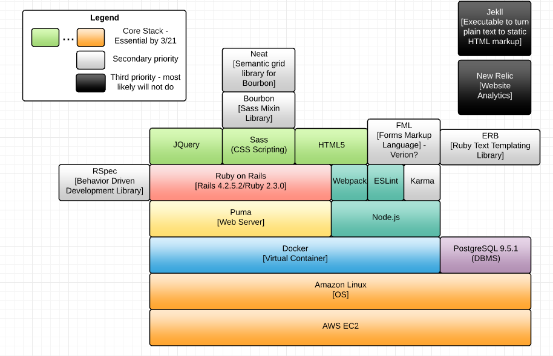

## Technology Stack


## Environments

**Development Environment:** is on developer's local computer. Used to develop code, perform automated and non automated tests and commit code to GitHub repository.

**Release Environment:** is provisioned using Amazon EC2 services and can be accessed using [www.usdsdemo.com](www.usdsdemo.com).

## Tools used in our DevOps Environment

**Docker Engine:** Build and run containerized images for testing and deployment.

**Docker Machine:** Provisions Docker-ready EC2 instances

**Docker Compose:** Orchestrate coupled container run time (example: containers running RoR connecting to a container running PostgreSQL)

## Deployment Instructions
 
 - Prerequisites
     
      ``` 
        export AWS_ACCESS_KEY_ID=..................
        
        export AWS_SECRET_ACCESS_KEY=......................
        
        export AWS_VPC_ID=vpc-3ac7d95f
        
        export AWS_SUBNET_ID=subnet-67614e10
        
        export AWS_SECURITY_GROUP=docker-machine
      ```
    
    
 - Provisioning EC2 Instance
 
    `docker-machine -D create --driver amazonec2 vetsgovdemo-instance1`
    
 - Check the Machines
 
    `$ docker-machine ls`   
    
 - Make Active vetsgovdemo-instance1 (EC2)
 
    `eval $(docker-machine env vetsgovdemo-instance1)`
    
 - Install the Application & Database in (EC2)
 
   ` ./scripts/start-compose.sh`
   
 - Refresh the Application
 
    `./scripts/clean-compose.sh`